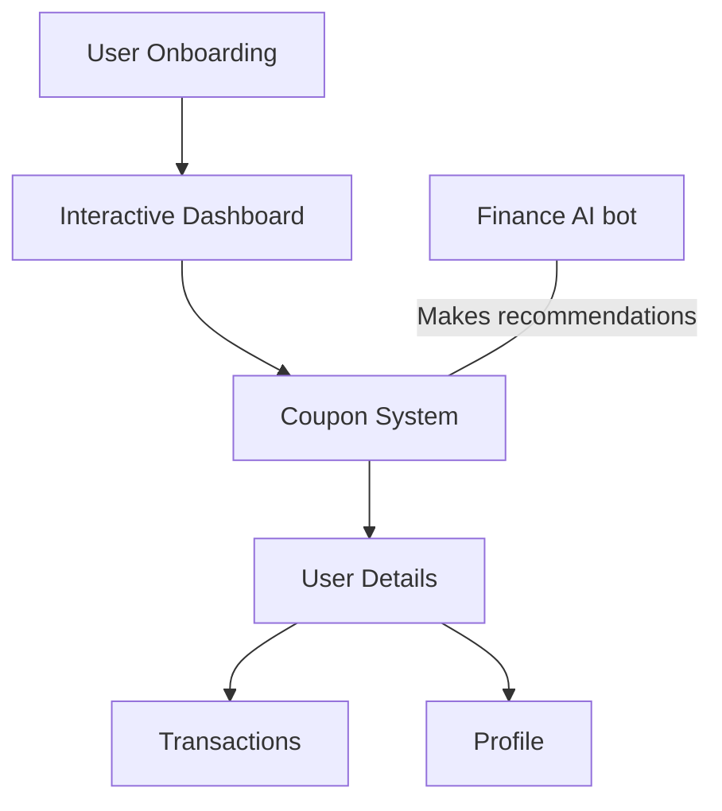

# Finance Guru

Gamified application for a user's personal finances. Tracks all the transactions and expenses of a user and recommends Bajaj products and well as provides incentives to the user. 

## Features

- Micro-investment - The application rounds up transactions and invest the remaining amount into strategic policies. 
- Monitoring and alerts - Improves financial awareness, prevents frauds by reminding of timely bill payments.
- Budgeting - Helps in proactive financial management, target based cost cutting etc.
- Tracking - Displays a comprehensive financial overview, expense trend analysis along with cash flow management. 

## Flow chart 

## Technical stacks used

